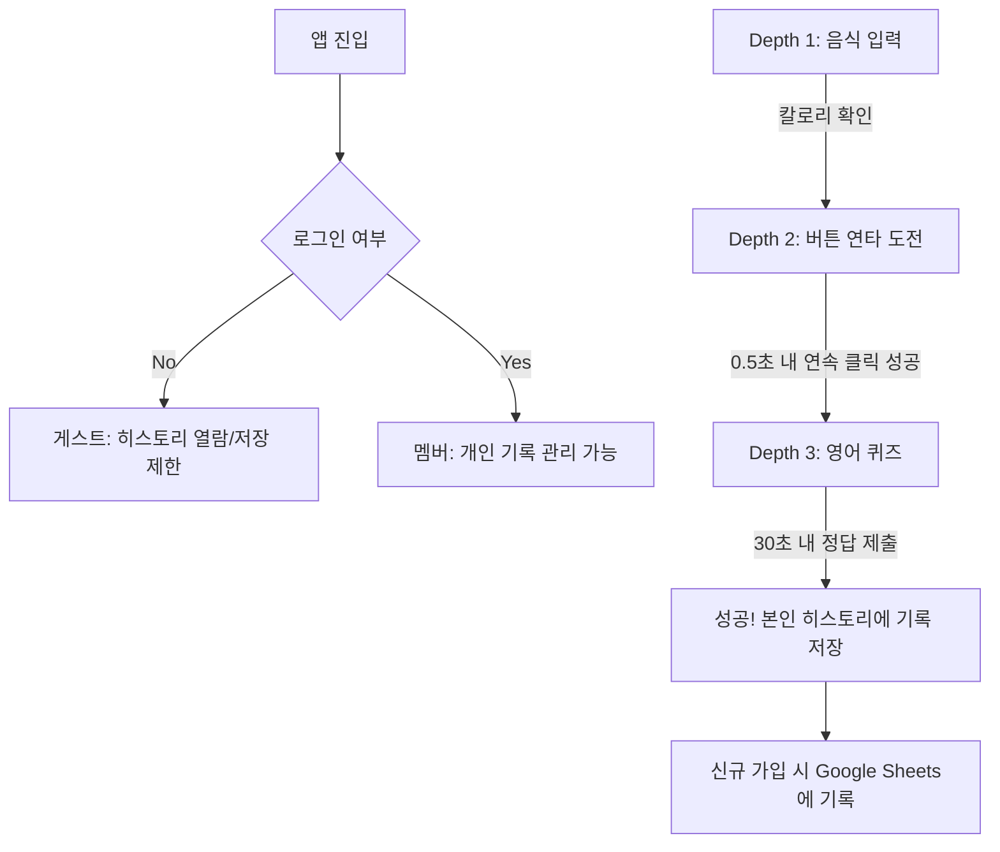

# 꿀돼지 (Honey Pig) - 구현 계획서

야식을 '의식적인 선택'으로 바꾸는 반응형 웹 서비스를 구현합니다.

## 기술 스택

| 영역 | 선택 | 이유 |
|------|------|------|
| **프레임워크** | **Next.js 14 + TypeScript** | React 기반 프로덕션 표준, SSR/SSG 지원, 타입 안정성 |
| **인증** | **NextAuth.js** | 구글 계정 통합, 세션 관리 표준 |
| **데이터 로깅** | **Google Sheets API** | 별도 DB 없이 가입자 현황 관리 가능 |
| **스타일링** | **Tailwind CSS v3** | 유틸리티 퍼스트, 빠른 UI 개발, 업계 표준 |
| **상태관리** | React useState/useReducer | 복잡하지 않은 로컬 상태 |
| **저장소** | LocalStorage | 사용자별/브라우저별 독립 기록 저장 |

---

## 핵심 시스템

### 🔐 구글 인증 & 가입자 현황
1. **회원가입 서비스**: 구글 로그인을 통한 간편 인증.
2. **가입자 로그 (Google Sheets)**:
   - 신규 사용자가 로그인 시 `가입일시`, `계정(이메일)`, `사용자명`을 스프레드시트에 자동 기록.
   - **중복 방지**: 이메일 체크를 통해 최초 1회만 기록하여 '가입자 현황' 유지.
   - **헤더 관리**: 시트 첫 줄에 제목이 없을 경우 자동으로 헤더 생성.

### 🍱 내장 음식 데이터 (1,000kcal 이상)
- 치킨, 피자, 족발 등 20종 이상의 고열량 메뉴 탑재.
- 미등록 데이터는 기본 1,000kcal로 처리.

---

## 사용자 여정 (Flow)

1. **Depth 1: 음식 입력**
2. **Depth 2: 의지력 증명 (버튼 연타)**
   - 0.5초 타임아웃 적용 (실패 시 리셋)
3. **Depth 3: 뇌 운동 (영어 퀴즈)**
   - 대학생 수준 4지선다형
4. **성공 보상**: 로그인 정보와 결합하여 히스토리 탭에 영구 저장.

---

## 검증 완료 항목
- [x] 구글 OAuth 2.0 연동 및 세션 유지
- [x] 사용자 이메일별 야식 기록 분리 저장
- [x] Google Sheets API를 통한 자동 가입자 명부 생성
- [x] 모바일 반응형 UI 및 타격감 UX 최적화
