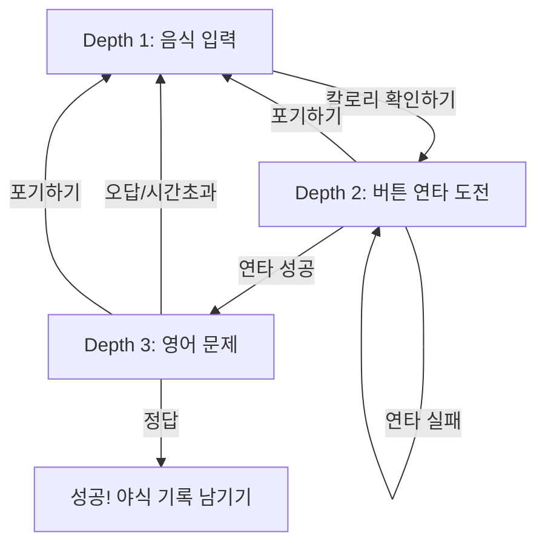

# 꿀돼지 (Honey Pig) - 구현 계획서

야식을 '의식적인 선택'으로 바꾸는 반응형 웹 서비스를 구현합니다.

## 기술 스택

| 영역 | 선택 | 이유 |
|------|------|------|
| **프레임워크** | **Next.js 14 + TypeScript** | React 기반 프로덕션 표준, SSR/SSG 지원, 타입 안정성 |
| **스타일링** | **Tailwind CSS v3** | 유틸리티 퍼스트, 빠른 UI 개발, 업계 표준 |
| **칼로리 API** | 내장 데이터 + 추정 로직 | 외부 API 의존성 최소화 |
| **영어 문제** | 내장 문제 풀 | 대학생 수준 영어 빈칸 채우기 |
| **상태관리** | React useState/useReducer | 복잡하지 않은 로컬 상태 |
| **저장소** | LocalStorage | 클라이언트 기록 저장 (추후 DB 확장 가능) |

---

## 내장 음식 데이터 (1,000kcal 이상만)

| # | 음식명 | 칼로리(kcal) | 연타 횟수 |
|---|--------|-------------|----------|
| 1 | 치킨 (한마리) | 2,500 | 25 |
| 2 | 피자 (라지) | 2,400 | 24 |
| 3 | 족발 (대) | 2,200 | 22 |
| 4 | 보쌈 (대) | 2,000 | 20 |
| 5 | 양념치킨 | 2,800 | 28 |
| 6 | 후라이드치킨 | 2,500 | 25 |
| 7 | 족발 (소) | 1,800 | 18 |
| 8 | 보쌈 (소) | 1,600 | 16 |
| 9 | 피자 (미디엄) | 1,600 | 16 |
| 10 | 탕수육 (대) | 1,800 | 18 |
| 11 | 탕수육 (중) | 1,200 | 12 |
| 12 | 햄버거 (세트) | 1,100 | 11 |
| 13 | 짜장면 + 탕수육 | 1,500 | 15 |
| 14 | 짬뽕 + 탕수육 | 1,400 | 14 |
| 15 | 마라탕 (곱빼기) | 1,200 | 12 |
| 16 | 삼겹살 (2인분) | 1,200 | 12 |
| 17 | 떡볶이 (대) | 1,000 | 10 |
| 18 | 갈비찜 (2인분) | 1,400 | 14 |
| 19 | 곱창 (1인분) | 1,000 | 10 |
| 20 | 닭볶음탕 | 1,100 | 11 |

### 🔍 키워드 매칭 로직
1. **부분 매칭**: 입력값이 음식명에 포함되면 매칭
2. **유사어 사전**: `마라탕 → 마라탕`, `짜장 → 짜장면` 등
3. **매칭 실패 시**: 기본값 1,000kcal 적용

---

## 핵심 사용자 여정

1. **Depth 1: 음식 입력**
2. **Depth 2: 의지력 증명 (버튼 연타)**
   - 0.5초 내에 다음 클릭이 이뤄져야 함 (실패 시 리셋)
   - 타격감 있는 UX (Scale Punch, Shake)
3. **Depth 3: 뇌 운동 (영어 퀴즈)**
   - 대학생 수준의 4지선다형 문제
   - 30초 제한 시간
4. **성공: 야식 기록 저장**
   - LocalStorage에 저장되어 히스토리 탭에서 확인 가능

---

## 디자인 철학

- **브랜딩**: 죄책감을 이성적 판단으로 바꾸는 건강한 통제
- **UX**: 강제적 금지보다 '이성적 마찰' 제공
- **심리**: 자발적 선택을 통한 결과 수용 및 성취감 고취
